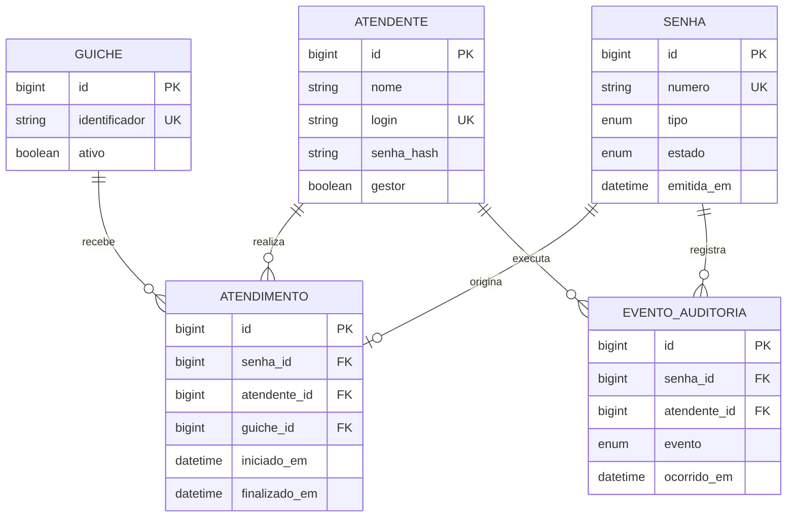

# Modelo Entidade-Relacionamento inicial

O modelo abaixo orientará a persistência no MySQL na segunda fase.

```mermaid
erDiagram
    ATENDENTE ||--o{ ATENDIMENTO : realiza
    GUICHE ||--o{ ATENDIMENTO : recebe
    SENHA ||--o| ATENDIMENTO : origina
    SENHA ||--o{ EVENTO_AUDITORIA : registra
    ATENDENTE ||--o{ EVENTO_AUDITORIA : executa

    SENHA {
        bigint id PK
        string numero UK
        enum tipo
        enum estado
        datetime emitida_em
    }
    ATENDENTE {
        bigint id PK
        string nome
        string login UK
        string senha_hash
        boolean gestor
    }
    GUICHE {
        bigint id PK
        string identificador UK
        boolean ativo
    }
    ATENDIMENTO {
        bigint id PK
        bigint senha_id FK
        bigint atendente_id FK
        bigint guiche_id FK
        datetime iniciado_em
        datetime finalizado_em
    }
    EVENTO_AUDITORIA {
        bigint id PK
        bigint senha_id FK
        bigint atendente_id FK
        enum evento
        datetime ocorrido_em
    }
```

