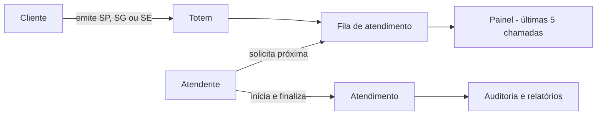
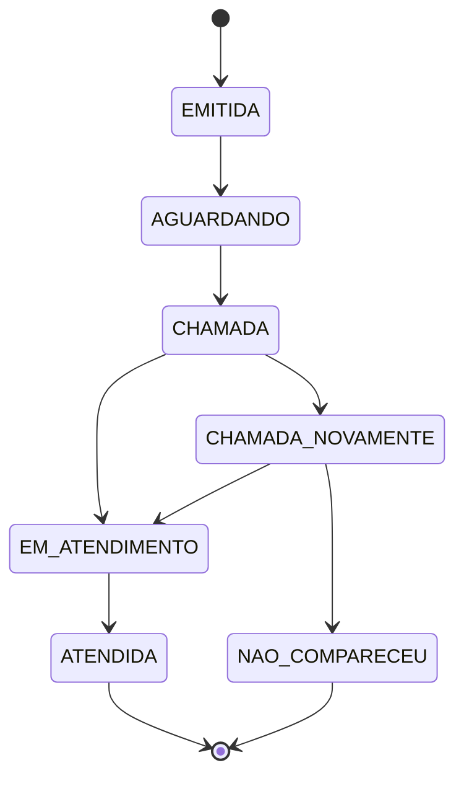

# Diagramas UML iniciais

## Fluxo principal

```mermaid
flowchart LR
    AC[Cliente] -->|emite SP, SG ou SE| T[Totem]
    T --> F[Fila de atendimento]
    AA[Atendente] -->|solicita próxima| F
    F --> P[Painel - últimas 5 chamadas]
    AA -->|inicia e finaliza| SA[Atendimento]
    SA --> A[Auditoria e relatórios]
```

## Máquina de estados da senha

```mermaid
stateDiagram-v2
    [*] --> EMITIDA
    EMITIDA --> AGUARDANDO
    AGUARDANDO --> CHAMADA
    CHAMADA --> EM_ATENDIMENTO
    CHAMADA --> CHAMADA_NOVAMENTE
    CHAMADA_NOVAMENTE --> EM_ATENDIMENTO
    CHAMADA_NOVAMENTE --> NAO_COMPARECEU
    EM_ATENDIMENTO --> ATENDIDA
    ATENDIDA --> [*]
    NAO_COMPARECEU --> [*]
```

